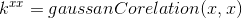
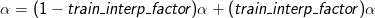
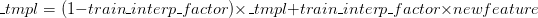

# 毕业设计代码

## 改动kcftracker.cpp与kcftracker.hpp
删除了一些函数和多分支（LAB，FIXEDWINDOW等）的赋值，更改了namespace为kcf，程序运行流畅，帧数约为13FPS（70ms）

## Parameters
|参数名|值|含义|
|:-:|:-:|:-|
|translation:|||  
|detect_thresh_kcf|0.13|dont know meaning|  
|template_size|96|template size in pixels, 0 to use ROI size,the value (template_size/cell_size) should be a power of 2 or a product of small prime numbers|
|lambda|0.0001|regularization| 
|padding|1.5|area surrounding the target, relative to its size|
|out_put_sigma_factor|0.125|bandwidth of gaussian target|
|if(hog)/else:||| 
|interp_factor|0.012/0.075|linear interpolation factor for adaptation|
|sigma|0.6/0.2|gaussian kernel bandwidth|  
|cell_size|4/1|hog cell size|
|scale:|
|scale_step|1.05|scale step for multi-scale estimation, 1 to disable it, a in DSST article |
|scale_weight|0.95|downweight detection scores of other   scales for added stability|
|scale_padding|1.0|extra area surrounding the target for scaling|  
|scale_sigma_factor|0.25|bandwidth of Gaussion|
|n_scales|33|number of scales|
|scale_lr|0.025|scale learning rate| 
|scale_max_area|512|max ROI size before compressing|
|scale_lambda|0.01|regularization|

translation:  
detect_thresh_kcf = 0.13;		//dont know meaning  
template\_size = 96   			//template size in pixels, 0 to use ROI size,the value (template_size/cell_size) should be a power of 2 or a product of small prime numbers  
lambda = 0.0001;				//regularization  
padding = 1.5;					//area surrounding the target, relative to its size  
out_put_sigma_factor = 0.125;	//bandwidth of gaussian target  

if(hog)/else  
interp_factor= 0.012/0.075;		//linear interpolation factor for adaptation  
sigma = 0.6/0,2;				//gaussian kernel bandwidth  
cell\_size = 4/1; 				//hog cell size if(hog)->cell_size=4 else->cell_size=1  

scale:  
scale_step = 1.05;				//scale step for multi-scale estimation, 1 to disable it, a in DSST article  
scale_weight = 0.95;			//downweight detection scores of other   scales for added stability  
scale_padding = 1.0				//extra area surrounding the target for scaling  
scale_sigma_factor = 0.25		//bandwidth of Gaussion  
n_scales = 33;  				//number of scales
scale_lr = 0.025;				//scale learning rate  
scale_max_area = 512;			//max ROI size before compressing  
scale_lambda = 0.01;			//regularization  

## Variables
|变量名|解释|
|:-:|:-|
|_roi|input in init, output in update;  |
|_alphaf|alphaf in paper, use this to calculate the detect result, changed in train();  |
|_prob|Gaussian Peak(training outputs);  |
|_tmpl|features of image (or the normalized gray image itself  when raw), changed in train();  |
|_num|numerator: use to update as MOSSE  |
|_den|denumerator: use to update as MOSSE  |
|_size_patch|0:rows;1:cols;2:numFeatures; init in getFeatures();  |
|base_width_dsst|roi.width|
|scale_model_width|if base_width_dsst>max_area,scale_model_width=resized based_with_dsst|
|scale:|  
|scaleFactors|a^n in DSST article|

_roi				//input in init, output in update;  
_alphaf				//alpha in paper, use this to calculate the detect result, changed in train();  
_prob	  			//Gaussian Peak(training outputs);  
_tmpl	  			//features of image (or the normalized gray image itself  when raw), changed in train();  
_num	   			//numerator: use to update as MOSSE  
_den	   			//denumerator: use to update as MOSSE  
_size_patch			//0:rows;1:cols;2:numFeatures; init in getFeatures();  
base_width_dsst		//roi.width
scale_model_width	//if base_width_dsst > max_area,scale_model_width=resized based_with_dsst

scale:  
scaleFactors	//a^n in DSST article  

## Functions
---

### init();  
translation init + scale init.  
translation init:  
1. 初始化_size_patch，提取特征feature
2. 用特征创建_prob
3. 训练第一帧的位置滤波器

scale init(init_scale+ tran_scale):  
1. init_scale():初始化n_scale个尺度的值，储存在scaleFactors中
2. tran_scale():用scalesFactors提样本（sample），并用它们训练尺度滤波器

---

### update();  
1. 用detect()和detect_scale()函数检测出位置与尺度
2. 用train()和train_scale()函数更新位置滤波器和尺度滤波器

---

### train();  
#### 1.训练滤波器_alphaf
step1 get_kxx  

     

step2 get filter this frame  

     

    step3 update filter  

     

#### 2.训练模板 

     

---

### train_scale();  
#### 1.获得特征feature（也叫sample）
#### 2.训练尺度滤波器的分子_den_dsst与分母_num_dsst
step1 get filter this frame  

     

     

step2 update filter

     

- input of train_scale() is the raw image, while input of train() is the feature.

---

## 核心函数
getFeature()  
creatGaussianPeak()  
init()
tran()  
init_dsst()	-> init_scale  
train_dsst  ->  train_scale  

## 训练
训练分两种方式：MOSSE方式和KCF的方式，还没比较两种方法的速度，可能KCF更快，因为KCF是MOSSE后面提出的弄懂了KCF的原理提出的更新方法。
- KCF方式将滤波器看成一个整体进行更新，即更新_alphaf，OpenTracker项目中用的均是这种方法
- MOSSE方式分为分子和分母进行更新，即更新_num, _den，DSST论文中用的是这种方式

